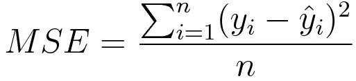
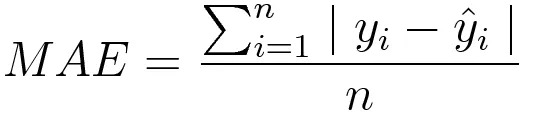
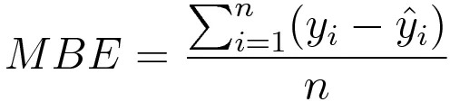

# Loss-Function-Library
A library of loss functions to use on your supervised learning models.

In machine learning, loss functions serve as a way to determine how accurate your model's predictions(x) are compared to the labeled data(y) to quantify how happy you are with your parameters(W). However, there isn't a single loss function that works for all algorithms. Selecting a loss function for a given problem involves a number of considerations, including the machine learning method of choice, the simplicity of the derivative calculations, and, to some extent, the proportion of outliers in the data set.

Generally speaking, loss functions fall into two main groups based on the kind of learning job we are working on: regression losses and classification losses. In classification, we attempt to forecast the result of a set of finite categorical values, i.e., classifying a big data set of images handwritten digits into one of nine possible categories.Conversely, regression is concerned with forecasting a continuous value, such as a particular floor area, number of rooms, or size of rooms, and predicts the room's price.

**Note for Formulas**

```
n        - Number of training examples.
i        - ith training example in a data set.
y(i)     - Ground truth label for ith training example.
y_hat(i) - Prediction for ith training example.
```

# Regression Losses
There are three main forms of regression loss used in deep learning: L<sub>2</sub> Loss (Mean Square Error/Quadratic Loss), L<sub>1</sub> Loss (Mean Absolute Error), and Mean Bias Error.

## Mean Square Error (MSE)/Quadratic Loss/L<sub>2</sub> Loss
Mathematical Formula:



As the name suggests, MSE measures the average of the squared difference between predictions and actual observations. It's only concerned with their average magnitude—not the direction of errors. Squaring, however, results in a heavier penalty for forecasts that differ greatly from actual values compared to less deviant predictions. Additionally, MSE has good mathematical qualities that facilitate gradient computation.

### Implementation:

**Default Python (No Libraries)**
```
import numpy as np

y_hat = np.array([0.000, 0.166, 0.333])
y_true = np.array([0.000, 0.254, 0.998])

def rmse(predictions, targets):
    differences = predictions - targets
    differences_squared = differences ** 2
    mean_of_differences_squared = differences_squared.mean()
    rmse_val = np.sqrt(mean_of_differences_squared)
    return rmse_val

print("d is: " + str(["%.8f" % elem for elem in y_hat]))
print("p is: " + str(["%.8f" % elem for elem in y_true]))
rmse_val = rmse(y_hat, y_true)
print("rms error is: " + str(rmse_val))
```

**[Python With Pytorch](https://pytorch.org/docs/master/generated/torch.nn.MSELoss.html#torch.nn.MSELoss)**
```
torch.nn.MSELoss(size_average=None, reduce=None, reduction='mean')
```

**[Python With TensorFlow](https://www.tensorflow.org/api_docs/python/tf/nn/l2_loss)**
```
tf.keras.losses.MSE(
    y_true, y_pred
)
```

## Mean Absolute Error/L<sub>1</sub> Loss
Mathematical Formula:



On the other hand, mean absolute error is calculated as the mean of the total absolute discrepancies between the actual observations and the projections. Similar to MSE, this gauges the error's magnitude without taking direction into account. In contrast to MSE, MAE requires more advanced methods to compute the gradients, including linear programming. Furthermore, because MAE does not utilize squares, it is more resilient to outliers.

### Implementation 

**Default Python (No Libraries)**
```
import numpy as np
y_hat = np.array([0.000, 0.166, 0.333])
y_true = np.array([0.000, 0.254, 0.998])

def mae(predictions, targets):
    differences = predictions - targets
    absolute_differences = np.absolute(differences)
    mean_absolute_differences = absolute_differences.mean()
    return mean_absolute_differences

print("d is: " + str(["%.8f" % elem for elem in y_hat]))
print("p is: " + str(["%.8f" % elem for elem in y_true]))
mae_val = mae(y_hat, y_true)
print ("mae error is: " + str(mae_val))
```

**[Python With Pytorch](https://pytorch.org/docs/stable/generated/torch.nn.L1Loss.html)**
```
from torch import nn

torch.nn.L1Loss(size_average=None,reduce=None,reduction='mean')
```

**[Python With TensorFlow]()**
```
import tensforflow as tf
from tensorflow import keras
from keras import losses

tf.keras.losses.MeanAbsoluteError(
    reduction='sum_over_batch_size',
    name='mean_absolute_error'
)
```

## Mean Bias Error
Mathematical Formula:


In the field of machine learning, this occurs far less frequently than its equivalent. The main distinction between this and MSE is that we don't use absolute values. Given that positive and negative errors may cancel each other out, vigilance is obviously warranted. It could identify if the model has positive or negative bias, even though it would be less accurate in practice.

### Implementation 

**Default Python (No Libraries)**
```
import numpy as np
y_hat = np.array([0.000, 0.166, 0.333])
y_true = np.array([0.000, 0.254, 0.998])

def mean_bias_error(y_true, y_hat):
  y_true = np.asarray(y_true)
  y_hat = np.asarray(y_hat)

  return np.mean(y_pred - y_true)

print("d is: " + str(["%.8f" % elem for elem in y_hat]))
print("p is: " + str(["%.8f" % elem for elem in y_true]))
mbe_val = mean_bias_error(y_true, y_hatd)
print("mbe error is: " + str(mbe_val))
```

**Python With Pytorch**
```
import torch

def mean_bias_error(preds, targets):
  return torch.mean(torch.abs(preds - targets))
```

**Python With TensorFlow**
```
import tensorflow as tf
from tensorflow import keras
from keras import losses

def mean_bias_error(y_true, y_pred):
  return tf.reduce_mean(tf.abs(y_true - y_pred))
```

# Classification Losses

#Hinge Loss/Multi class SVM Loss

In the field of machine learning, this occurs far less frequently than its equivalent. The main distinction between this and MSE is that we don't use absolute values. Given that positive and negative errors may cancel each other out, vigilance is obviously warranted. It could identify if the model has positive or negative bias, even though it would be less accurate in practice.